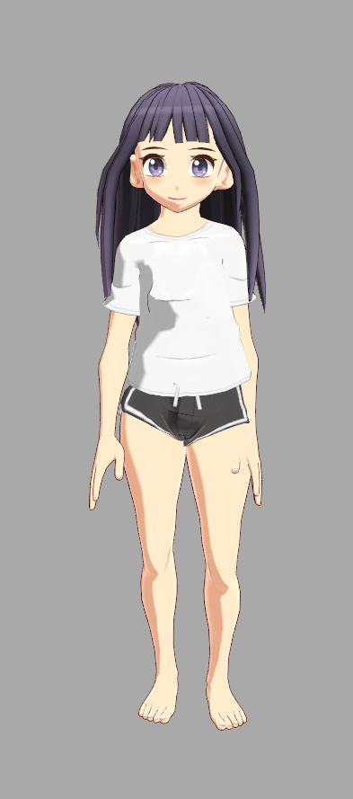
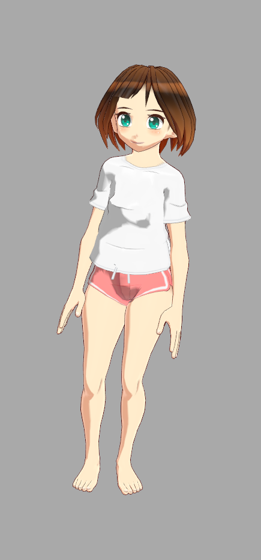
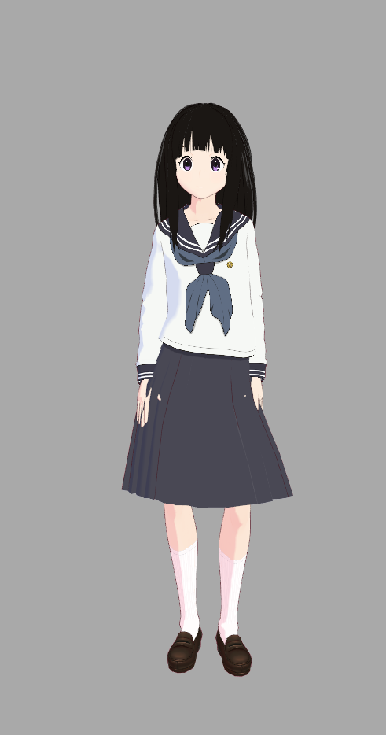
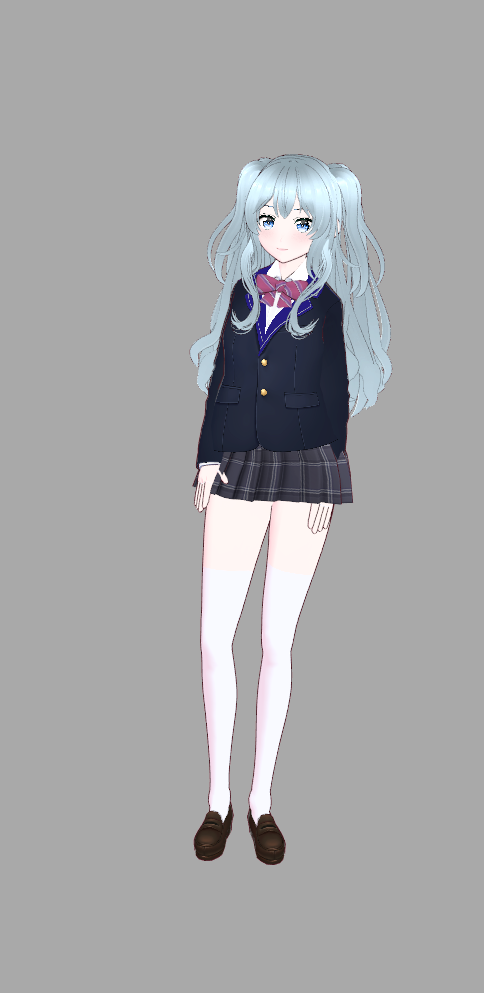
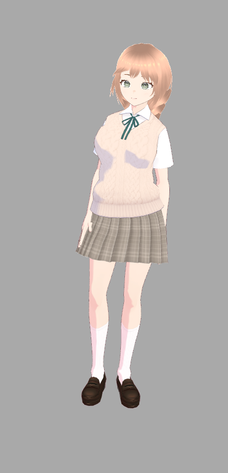

# Desktop Waifu

A desktop companion app featuring animated 3D VRM characters with AI-powered conversational chat.

<!-- TODO: Add screenshots/GIFs here


-->

## Features

- **6 Selectable 3D Characters** - Fully animated VRM models with idle, talking, and expression animations
- **Multi-Provider LLM Support** - OpenAI, Anthropic Claude, and Google Gemini integration
- **7 Customizable Personalities** - From friendly companion to professional tutor
- **Desktop Overlay Mode** - Floats above other windows as a desktop pet (currently Wayland-only, cross-platform planned)
- **Streaming Chat** - Real-time responses with full markdown support
- **Persistent Settings** - Character, personality, and API preferences saved locally

## Installation

### Arch Linux (AUR)

```bash
yay -S desktop-waifu
# or
paru -S desktop-waifu
```

### Debian/Ubuntu (.deb)

Download the latest `.deb` from [GitHub Releases](https://github.com/yv-was-taken/desktop-waifu/releases):

```bash
# Download and install
wget https://github.com/yv-was-taken/desktop-waifu/releases/latest/download/desktop-waifu_0.1.0-1_amd64.deb
sudo dpkg -i desktop-waifu_0.1.0-1_amd64.deb
```

### macOS (Homebrew)

> **Note:** macOS support is planned but not yet available. The formula is published for future use.

```bash
brew tap yv-was-taken/desktop-waifu
brew install desktop-waifu
```

### NixOS / Nix

```bash
# Run directly without installing
nix run github:yv-was-taken/desktop-waifu

# Install to user profile
nix profile install github:yv-was-taken/desktop-waifu

# Or add to your NixOS configuration (flake-based):
# inputs.desktop-waifu.url = "github:yv-was-taken/desktop-waifu";
# environment.systemPackages = [ inputs.desktop-waifu.packages.${system}.default ];
```

### From Source

See [Getting Started](#getting-started) below.

## Tech Stack

| Category | Technologies |
|----------|-------------|
| Frontend | React 19, TypeScript, Vite, Tailwind CSS |
| 3D | Three.js, React Three Fiber, @pixiv/three-vrm |
| State | Zustand with localStorage persistence |
| Desktop | GTK4 Layer Shell overlay + Tauri (launcher) |
| LLM | OpenAI, Anthropic, Google Gemini SDKs |

## Compatibility

Desktop Waifu currently requires **Linux with Wayland**. Cross-platform support is planned for future releases.

| Platform | Status |
|----------|--------|
| Linux (Wayland) | ✅ Supported |
| Linux (X11) | 🚧 Planned |
| macOS | 🚧 Planned |
| Windows | 🚧 Planned |

## Repository Structure

```
desktop-waifu/
├── src/
│   ├── components/
│   │   ├── character/     # 3D canvas, VRM model rendering, animations
│   │   ├── chat/          # Chat UI components, message handling
│   │   └── ui/            # Settings modal, shared UI components
│   ├── lib/
│   │   ├── llm/providers/ # LLM provider implementations
│   │   ├── personalities/ # Personality definitions and prompts
│   │   └── three/         # Three.js utilities
│   ├── characters/        # Character configuration
│   ├── hooks/             # React hooks
│   ├── store/             # Zustand state management
│   └── types/             # TypeScript type definitions
├── public/
│   ├── characters/        # VRM model files
│   └── animations/        # VRMAnimation files
├── desktop-waifu-overlay/ # Rust GTK4 overlay application
├── packaging/             # Distribution packaging (AUR, deb, Homebrew)
├── scripts/               # Build scripts
└── src-tauri/             # Tauri configuration
```

## Getting Started

### Prerequisites

- [Bun](https://bun.sh/) (JavaScript runtime and package manager)
- [Rust](https://www.rust-lang.org/tools/install) (for overlay build)
- Linux with Wayland compositor
- GTK4 and gtk4-layer-shell

### Installation

```bash
# Clone the repository
git clone https://github.com/yv-was-taken/desktop-waifu.git
cd desktop-waifu

# Install dependencies
bun install
```

### Development

```bash
# Start development (Wayland overlay)
bun dev

# Start web dev server only (for frontend debugging)
bun dev:web
```

### Production Build

```bash
# Build everything (web + overlay)
bun build

# Build web only
bun build:web
```

## Configuration

### API Keys

Configure your LLM provider API key in the settings modal (gear icon):

1. Select your preferred provider (OpenAI, Anthropic, or Google)
2. Enter your API key
3. Choose a model

API keys are stored locally in `~/.local/share/desktop-waifu/`

### Characters

6 characters are available, each with the same animation set but unique appearances:

| Emily | Grace | Jessica |
|:-----:|:-----:|:-------:|
|  |  |  |
| **Rose** | **Sam** | **Victoria** |
|  |  |  |

### Personalities

Choose from 7 personality presets that affect how the AI responds:

| Personality | Description |
|-------------|-------------|
| Naive Girlfriend | Sweet, caring, emotionally supportive |
| Smart Girlfriend | Intellectually curious, witty, engaging |
| Friend | Casual, supportive, down-to-earth |
| Tutor | Educational, patient, encouraging |
| Life Coach | Motivational, goal-oriented, insightful |
| Creative Partner | Imaginative, collaborative, artistic |
| Assistant | Professional, efficient, knowledgeable |

### Adding Models

Model files must be in **VRM format** (`.vrm`). The application uses `@pixiv/three-vrm` which only supports VRM files.

**Adding a new character:**

1. Place your `.vrm` file in `public/characters/` (e.g., `public/characters/mycharacter.vrm`)

2. Register the character in `src/characters/index.ts`:

```typescript
export const characters: Record<string, Character> = {
  // ... existing characters
  mycharacter: createCharacter('mycharacter', 'My Character', {
    scale: 0.8,        // Adjust for character height
    rotation: [0, 0, 0] // May need adjustment based on model orientation
  }),
};
```

**Configuration options:**

| Option | Default | Description |
|--------|---------|-------------|
| `scale` | `0.8` | Controls character size. Adjust if your model appears too tall/short |
| `position` | `[0, -1, 0]` | World position `[x, y, z]`. Y offset positions the model vertically |
| `rotation` | `[0, Math.PI, 0]` | Rotation in radians. Some models face +Z natively and need `[0, 0, 0]` |

**Important: Manual verification required**

VRM models vary significantly in their default height and orientation. After adding a new model, you must visually verify it fits correctly within the canvas:

- **Height issues:** Some models may appear too tall (head cut off) or too short. Adjust the `scale` value in the config until the character fits properly in the viewport.
- **Rotation issues:** Some models face away from the camera by default. If your character's back is facing you, try changing `rotation` to `[0, 0, 0]` or adjust the Y-axis rotation value.

Test your model by running `bun dev` and selecting your character to verify it displays correctly.

**Contributing models:** If you'd like to add new characters to the project, please submit a Pull Request with your `.vrm` file and the corresponding config entry. Ensure the `scale` and `rotation` values are properly calibrated before submitting. Include screenshots or videos in your PR demonstrating that the character is positioned correctly in the canvas and that animations display properly.

### Adding Animations

Animation files must be in **VRMA format** (`.vrma`), not FBX. The application uses `@pixiv/three-vrm-animation` which only supports VRMA files.

**Converting FBX to VRMA:**

If you have FBX animation files (e.g., from [Mixamo](https://www.mixamo.com/)), convert them using [fbx2vrma-converter](https://github.com/tk256ailab/fbx2vrma-converter):

```bash
# Clone and set up the converter
git clone https://github.com/tk256ailab/fbx2vrma-converter.git
cd fbx2vrma-converter
bun install

# Convert an FBX file to VRMA
bun run fbx2vrma-converter.js -i /path/to/animation.fbx -o /path/to/output.vrma
```

Place converted `.vrma` files in `public/animations/`.

**Contributing animations:** If you'd like to add new animations to the project, please submit a Pull Request with your converted `.vrma` files.

## License

This project is licensed under the MIT License - see the [LICENSE](LICENSE) file for details.

## Contributing

Contributions are welcome! Please see [CONTRIBUTING.md](CONTRIBUTING.md) for guidelines.
